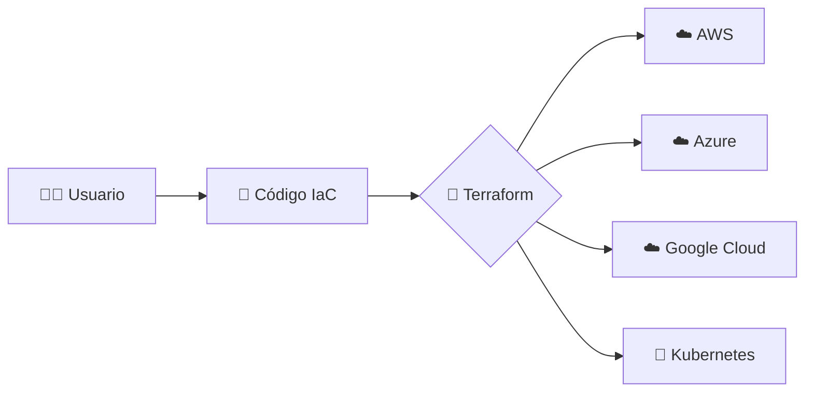
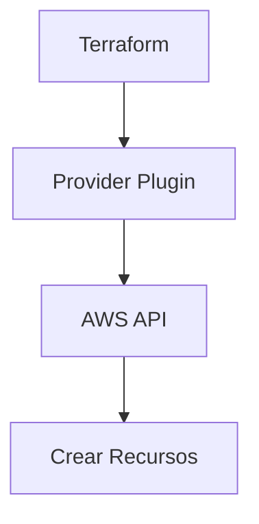
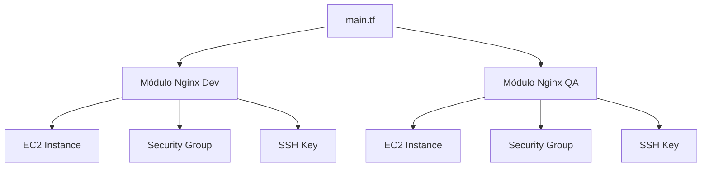
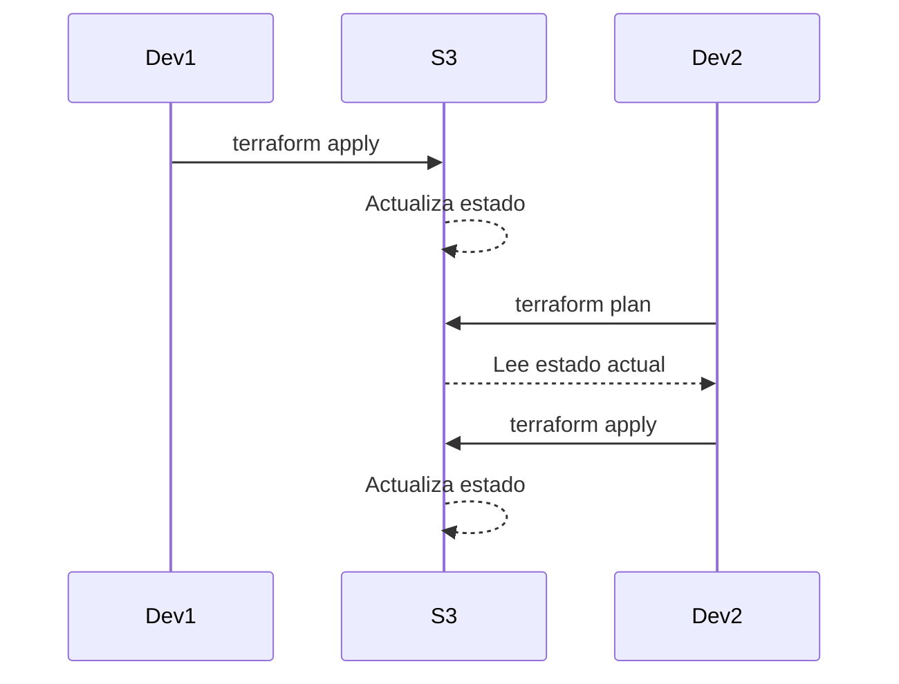
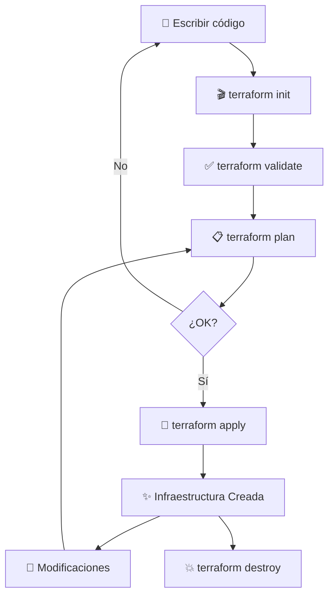

# 🚀 Curso Completo de Terraform - De Cero a Experto


---

## 📋 Tabla de Contenidos

1. [Introducción](#introducción)
2. [Instalación y Configuración](#instalación-y-configuración)
3. [Conceptos Básicos](#conceptos-básicos)
4. [Práctica: Primer Proyecto](#práctica-primer-proyecto)
5. [Variables y Outputs](#variables-y-outputs)
6. [Organización de Archivos](#organización-de-archivos)
7. [Módulos de Terraform](#módulos-de-terraform)
8. [Estado Remoto (Remote State)](#estado-remoto)
9. [Importación de Recursos](#importación-de-recursos)
10. [Buenas Prácticas](#buenas-prácticas)

---

## 🎯 Introducción

### ¿Qué es Terraform?

> **Terraform es una herramienta para automatizar la creación, gestión y configuración de infraestructura de manera declarativa.**



### 🌟 Características Principales

| Característica | Descripción |
|---------------|-------------|
| 📝 **Declarativo** | Defines QUÉ quieres, no CÓMO hacerlo |
| 🔄 **Multi-proveedor** | AWS, Azure, GCP, Kubernetes y más |
| 📚 **Versionable** | Tu infraestructura en Git |
| 🤝 **Colaborativo** | Trabajo en equipo facilitado |
| 🔍 **Plan antes de aplicar** | Vista previa de cambios |

### 💡 ¿Por qué Terraform?

```
✅ Infraestructura como Código (IaC)
✅ Automatización completa
✅ Control de versiones
✅ Reutilización de código
✅ Multi-cloud desde el inicio
```

---

## 🛠️ Instalación y Configuración

### Instalación de Terraform

#### 🪟 Windows
```powershell
# Usando winget
winget install Hashicorp.Terraform
```

#### 🍎 macOS
```bash
# Usando Homebrew
brew install terraform
```

#### 🐧 Linux
```bash
# Descargar binario y mover a PATH
wget https://releases.hashicorp.com/terraform/1.x.x/terraform_1.x.x_linux_amd64.zip
unzip terraform_1.x.x_linux_amd64.zip
sudo mv terraform /usr/local/bin/
```

### Verificar Instalación

```bash
terraform --version
```

**Salida esperada:**
```
Terraform v1.x.x
```

---

### ⚙️ Configuración de AWS CLI

```bash
# Instalar AWS CLI
# Windows: winget install Amazon.AWSCLI
# macOS: brew install awscli
# Linux: apt install awscli

# Configurar credenciales
aws configure
```

**Datos requeridos:**
- 🔑 AWS Access Key ID
- 🔐 AWS Secret Access Key
- 🌍 Default region (ej: us-east-1)
- 📄 Output format (json)

---

## 📚 Conceptos Básicos

### 1️⃣ Provider (Proveedor)

> Un **provider** es un plugin que interactúa con un servicio o API específica.

```hcl
provider "aws" {
  region = "us-east-1"
}
```



---

### 2️⃣ Resource (Recurso)

> Los **resources** son la unidad básica de configuración en Terraform.

**Estructura:**
```hcl
resource "tipo_recurso" "nombre_interno" {
  propiedad1 = "valor1"
  propiedad2 = "valor2"
}
```

**Ejemplo:**
```hcl
resource "aws_instance" "web_server" {
  ami           = "ami-0c55b159cbfafe1f0"
  instance_type = "t3.micro"
  
  tags = {
    Name = "Mi Servidor Web"
  }
}
```

---

### 3️⃣ Comandos Principales

| Comando | Descripción | Emoji |
|---------|-------------|-------|
| `terraform init` | Inicializa el directorio de trabajo | 🎬 |
| `terraform plan` | Genera un plan de ejecución | 📋 |
| `terraform apply` | Aplica los cambios | ✅ |
| `terraform destroy` | Destruye todos los recursos | 💥 |

```bash
# Flujo típico
terraform init      # 1. Inicializar
terraform plan      # 2. Revisar cambios
terraform apply     # 3. Aplicar
terraform destroy   # 4. Destruir (cuando ya no se necesite)
```

---

## 🎯 Práctica: Primer Proyecto

### 📁 Estructura del Proyecto

```
webinar-terraform/
├── main.tf
├── variables.tf
├── outputs.tf
└── README.md
```

---

### 🚀 Escenario de Práctica

```
🎯 OBJETIVO:
Levantar un sitio web en AWS EC2 con:
- ✅ Instancia t3.micro
- ✅ Nginx instalado
- ✅ Puertos 80 y 22 abiertos
- ✅ Llave SSH configurada
```

---

### 📝 Paso 1: Crear `main.tf`

```hcl
# Provider
provider "aws" {
  region = "us-east-1"
}

# EC2 Instance
resource "aws_instance" "nginx_server" {
  ami           = "ami-0c55b159cbfafe1f0"  # Amazon Linux 2023
  instance_type = "t3.micro"
  
  # Script de inicialización
  user_data = <<-EOF
              #!/bin/bash
              yum install -y nginx
              systemctl enable nginx
              systemctl start nginx
              EOF
  
  tags = {
    Name = "nginx-server"
  }
}
```

---

### 🔧 Paso 2: Inicializar y Aplicar

```bash
# 1. Crear el archivo
touch main.tf

# 2. Inicializar Terraform
terraform init
```

**Salida:**
```
Initializing the backend...
Initializing provider plugins...
- Finding latest version of hashicorp/aws...
- Installing hashicorp/aws v5.x.x...

Terraform has been successfully initialized! ✅
```

```bash
# 3. Ver el plan
terraform plan
```

```bash
# 4. Aplicar los cambios
terraform apply

# Terraform te preguntará:
Do you want to perform these actions?
  Enter a value: yes
```

---

### 🎉 Resultado

```
Apply complete! Resources: 1 added, 0 changed, 0 destroyed.
```


---

## 🔑 Agregando SSH Key

### Generar la clave SSH

```bash
ssh-keygen -t rsa -b 2048 -f nginx-server.key
```

**Archivos generados:**
- 🔒 `nginx-server.key` (privada - NO COMPARTIR)
- 🔓 `nginx-server.key.pub` (pública)

---

### Subir la clave a AWS

```hcl
resource "aws_key_pair" "nginx_server_ssh" {
  key_name   = "nginx-server-ssh"
  public_key = file("${path.module}/nginx-server.key.pub")
}

# Asociar con la instancia
resource "aws_instance" "nginx_server" {
  ami           = "ami-0c55b159cbfafe1f0"
  instance_type = "t3.micro"
  key_name      = aws_key_pair.nginx_server_ssh.key_name  # 👈 Nueva línea
  
  # ... resto del código
}
```

---

## 🔒 Security Group (Firewall)

```hcl
resource "aws_security_group" "nginx_server_sg" {
  name        = "nginx-server-sg"
  description = "Security group for nginx server"
  
  # Puerto 80 - HTTP
  ingress {
    from_port   = 80
    to_port     = 80
    protocol    = "tcp"
    cidr_blocks = ["0.0.0.0/0"]
  }
  
  # Puerto 22 - SSH
  ingress {
    from_port   = 22
    to_port     = 22
    protocol    = "tcp"
    cidr_blocks = ["0.0.0.0/0"]
  }
  
  # Tráfico de salida
  egress {
    from_port   = 0
    to_port     = 0
    protocol    = "-1"
    cidr_blocks = ["0.0.0.0/0"]
  }
  
  tags = {
    Name = "nginx-server-sg"
  }
}

# Asociar con la instancia
resource "aws_instance" "nginx_server" {
  ami                    = "ami-0c55b159cbfafe1f0"
  instance_type          = "t3.micro"
  key_name               = aws_key_pair.nginx_server_ssh.key_name
  vpc_security_group_ids = [aws_security_group.nginx_server_sg.id]  # 👈 Nueva línea
  
  # ... resto del código
}
```

---

## 🏷️ Tags (Etiquetas)

> **IMPORTANTE:** Siempre agregar tags a tus recursos para identificación y gestión de costos.

```hcl
resource "aws_instance" "nginx_server" {
  # ... configuración anterior
  
  tags = {
    Name        = "nginx-server"
    Environment = "development"
    Owner       = "tu-email@ejemplo.com"
    Team        = "DevOps"
    Project     = "webinar-terraform"
  }
}
```

### 📊 Tags Recomendados

| Tag | Propósito | Ejemplo |
|-----|-----------|---------|
| 🏷️ **Name** | Identificación visual | "nginx-server" |
| 🌍 **Environment** | Ambiente | "dev", "qa", "prod" |
| 👤 **Owner** | Responsable | "juan@empresa.com" |
| 👥 **Team** | Equipo | "DevOps", "Backend" |
| 📦 **Project** | Proyecto | "ecommerce" |

---

## 📤 Variables y Outputs

### Variables

**`variables.tf`:**
```hcl
variable "ami_id" {
  description = "AMI ID para la instancia"
  type        = string
  default     = "ami-0c55b159cbfafe1f0"
}

variable "instance_type" {
  description = "Tipo de instancia EC2"
  type        = string
  default     = "t3.micro"
}

variable "server_name" {
  description = "Nombre del servidor"
  type        = string
  default     = "nginx-server"
}

variable "environment" {
  description = "Ambiente de despliegue"
  type        = string
  default     = "development"
}
```

---

### Usar Variables

```hcl
resource "aws_instance" "nginx_server" {
  ami           = var.ami_id           # 👈 Usando variable
  instance_type = var.instance_type    # 👈 Usando variable
  
  tags = {
    Name        = var.server_name      # 👈 Usando variable
    Environment = var.environment      # 👈 Usando variable
  }
}
```

---

### Concatenar Variables

```hcl
resource "aws_key_pair" "nginx_server_ssh" {
  key_name   = "${var.server_name}-ssh"  # nginx-server-ssh
  public_key = file("${path.module}/${var.server_name}.key.pub")
}
```

---

### Archivo de Valores

**`terraform.tfvars`:**
```hcl
ami_id        = "ami-0c55b159cbfafe1f0"
instance_type = "t3.medium"
server_name   = "nginx-dev"
environment   = "development"
```

**`qa.tfvars`:**
```hcl
ami_id        = "ami-0c55b159cbfafe1f0"
instance_type = "t3.large"
server_name   = "nginx-qa"
environment   = "qa"
```

**Uso:**
```bash
# Usar archivo específico
terraform plan -var-file="qa.tfvars"
terraform apply -var-file="qa.tfvars"
```

---

### Outputs

**`outputs.tf`:**
```hcl
output "server_public_ip" {
  description = "Dirección IP pública del servidor"
  value       = aws_instance.nginx_server.public_ip
}

output "server_public_dns" {
  description = "DNS público del servidor"
  value       = aws_instance.nginx_server.public_dns
}
```

**Ver outputs:**
```bash
terraform output
```

**Salida:**
```
server_public_ip  = "3.232.132.17"
server_public_dns = "ec2-3-232-132-17.compute-1.amazonaws.com"
```

**Acceder a un output específico:**
```bash
terraform output server_public_ip
```

---

## 📂 Organización de Archivos

### 🎯 Estructura Recomendada

```
proyecto-terraform/
├── provider.tf          # Configuración del proveedor
├── variables.tf         # Definición de variables
├── terraform.tfvars     # Valores para desarrollo
├── qa.tfvars           # Valores para QA
├── ec2.tf              # Recursos EC2
├── security-groups.tf  # Security Groups
├── ssh-keys.tf         # Claves SSH
├── outputs.tf          # Outputs
└── README.md           # Documentación
```

---

### Separar Recursos

**`provider.tf`:**
```hcl
provider "aws" {
  region = "us-east-1"
}
```

**`ec2.tf`:**
```hcl
resource "aws_instance" "nginx_server" {
  ami           = var.ami_id
  instance_type = var.instance_type
  key_name      = aws_key_pair.nginx_server_ssh.key_name
  
  vpc_security_group_ids = [aws_security_group.nginx_server_sg.id]
  
  user_data = <<-EOF
              #!/bin/bash
              yum install -y nginx
              systemctl enable nginx
              systemctl start nginx
              EOF
  
  tags = {
    Name        = var.server_name
    Environment = var.environment
    Owner       = "devops@empresa.com"
    Team        = "DevOps"
    Project     = "webinar-terraform"
  }
}
```

**`ssh-keys.tf`:**
```hcl
resource "aws_key_pair" "nginx_server_ssh" {
  key_name   = "${var.server_name}-ssh"
  public_key = file("${path.module}/${var.server_name}.key.pub")
  
  tags = {
    Name = "${var.server_name}-ssh"
  }
}
```

---

## 🧩 Módulos de Terraform

### ¿Qué son los Módulos?

> Los **módulos** son paquetes de código Terraform reutilizables.



---

### Crear un Módulo

**Estructura:**
```
proyecto/
├── main.tf
├── nginx-server-module/
│   ├── ec2.tf
│   ├── security-groups.tf
│   ├── ssh-keys.tf
│   ├── variables.tf
│   └── outputs.tf
```

---

### Usar el Módulo

**`main.tf`:**
```hcl
# Módulo para Desarrollo
module "nginx_dev" {
  source = "./nginx-server-module"
  
  ami_id        = "ami-0c55b159cbfafe1f0"
  instance_type = "t3.micro"
  server_name   = "nginx-dev"
  environment   = "development"
}

# Módulo para QA
module "nginx_qa" {
  source = "./nginx-server-module"
  
  ami_id        = "ami-0c55b159cbfafe1f0"
  instance_type = "t3.medium"
  server_name   = "nginx-qa"
  environment   = "qa"
}
```

---

### Outputs del Módulo

**`nginx-server-module/outputs.tf`:**
```hcl
output "public_ip" {
  value = aws_instance.nginx_server.public_ip
}

output "public_dns" {
  value = aws_instance.nginx_server.public_dns
}
```

**Acceder a outputs del módulo:**
```hcl
output "nginx_dev_ip" {
  value = module.nginx_dev.public_ip
}

output "nginx_qa_ip" {
  value = module.nginx_qa.public_ip
}
```

---

### Inicializar Módulos

```bash
# Cada vez que agregues o modifiques un módulo
terraform init
```

---

## 💾 Estado Remoto (Remote State)

### ¿Qué es el Estado?

> El **terraform.tfstate** registra el estado actual de tu infraestructura.

```
⚠️ PROBLEMA: Estado local
❌ No colaborativo
❌ Riesgo de pérdida
❌ Información sensible en local

✅ SOLUCIÓN: Estado remoto (S3)
✅ Colaborativo
✅ Respaldado
✅ Seguro
```

---

### Configurar S3 Backend

**1. Crear bucket S3:**
```bash
# Desde AWS Console o CLI
aws s3 mb s3://webinar-terraform-state-12345
```

**2. Configurar backend:**
```hcl
terraform {
  backend "s3" {
    bucket = "webinar-terraform-state-12345"
    key    = "webinar/terraform.tfstate"
    region = "us-east-1"
  }
}
```

**3. Inicializar:**
```bash
terraform init
```

**Terraform preguntará:**
```
Do you want to migrate your existing state to the new backend?
Enter a value: yes
```

---

### Diagrama de Flujo



---

## 📥 Importación de Recursos

### ¿Por qué Importar?

```
Tienes recursos creados manualmente
         ↓
Quieres gestionarlos con Terraform
         ↓
¡Usa terraform import!
```

---

### Proceso de Importación

**1. Crear definición vacía:**
```hcl
resource "aws_instance" "server_web" {
  # Inicialmente vacío
}
```

**2. Importar recurso:**
```bash
terraform import aws_instance.server_web i-1234567890abcdef0
```

**3. Ver el estado:**
```bash
terraform state show aws_instance.server_web
```

**4. Copiar configuración:**
```hcl
resource "aws_instance" "server_web" {
  ami           = "ami-0c55b159cbfafe1f0"
  instance_type = "t2.medium"
  
  tags = {
    Name        = "server-web"
    Environment = "production"
    Owner       = "admin@empresa.com"
  }
}
```

---

## ✅ Buenas Prácticas

### 📋 Checklist de Buenas Prácticas

```
✅ Versiona tu código en Git
✅ Usa variables para valores reutilizables
✅ Separa archivos por funcionalidad
✅ Implementa módulos para código repetido
✅ Usa estado remoto (S3)
✅ Agrega tags a TODOS los recursos
✅ Documenta tu código
✅ Usa terraform fmt para formatear
✅ Ejecuta terraform validate
✅ Revisa terraform plan antes de apply
```

---

### 🏷️ Tags Obligatorios

```hcl
locals {
  common_tags = {
    Environment = var.environment
    Owner       = "devops@empresa.com"
    Team        = "DevOps"
    Project     = var.project_name
    ManagedBy   = "Terraform"
  }
}

resource "aws_instance" "ejemplo" {
  # ...
  tags = merge(
    local.common_tags,
    {
      Name = "mi-servidor"
    }
  )
}
```

---

### 📝 Formato y Validación

```bash
# Formatear código
terraform fmt

# Validar sintaxis
terraform validate

# Revisar cambios
terraform plan

# Aplicar con confirmación
terraform apply

# Aplicar sin confirmación (CI/CD)
terraform apply -auto-approve
```

---

### 🔐 Seguridad

```
❌ NO subas terraform.tfstate a Git
❌ NO hardcodees credenciales
❌ NO uses Access Keys en el código
✅ Usa variables de entorno
✅ Usa AWS IAM roles
✅ Usa .gitignore apropiado
```

**`.gitignore`:**
```
# Terraform
*.tfstate
*.tfstate.backup
.terraform/
*.tfvars
*.tfplan

# SSH Keys
*.pem
*.key
!*.key.pub
```

---

## 🎓 Comandos Avanzados

### 📊 Terraform Plan con Output

```bash
# Guardar plan
terraform plan -out=plan.tfplan

# Aplicar plan guardado
terraform apply plan.tfplan
```

---

### 🔍 Estado (State)

```bash
# Listar recursos
terraform state list

# Ver detalle de recurso
terraform state show aws_instance.nginx_server

# Mover recurso
terraform state mv aws_instance.old aws_instance.new

# Eliminar del estado (no destruye)
terraform state rm aws_instance.nginx_server
```

---

### 🎯 Targets

```bash
# Aplicar solo un recurso
terraform apply -target=aws_instance.nginx_server

# Destruir solo un recurso
terraform destroy -target=aws_security_group.nginx_server_sg
```

---

### 📦 Workspace

```bash
# Listar workspaces
terraform workspace list

# Crear workspace
terraform workspace new production

# Cambiar workspace
terraform workspace select development

# Workspace actual
terraform workspace show
```

---

## 🔄 Ciclo de Vida Completo



---

## 📚 Recursos Adicionales

### 🔗 Enlaces Útiles

| Recurso | URL |
|---------|-----|
| 📖 Documentación Oficial | [terraform.io/docs](https://www.terraform.io/docs) |
| 🎓 Tutoriales HashiCorp | [learn.hashicorp.com/terraform](https://learn.hashicorp.com/terraform) |
| 📦 Registry (Módulos) | [registry.terraform.io](https://registry.terraform.io) |
| 💬 Comunidad | [discuss.hashicorp.com](https://discuss.hashicorp.com) |

---

### 🎯 Próximos Pasos

1. ✅ **Practica** creando recursos simples
2. 🔄 **Refactoriza** usando variables y módulos
3. 🌐 **Implementa** estado remoto
4. 🚀 **Automatiza** con CI/CD (GitHub Actions, GitLab CI)
5. 📊 **Monitorea** tu infraestructura

---

## 🎉 ¡Felicidades!


### Has completado el curso de Terraform

```
🎓 Ahora sabes:
✅ Crear infraestructura como código
✅ Usar variables y módulos
✅ Gestionar estado remoto
✅ Importar recursos existentes
✅ Aplicar buenas prácticas
```

---

## 📬 Contacto

¿Preguntas? ¿Sugerencias?

- 📧 Email: devops@ejemplo.com
- 💼 LinkedIn: [Tu Perfil]
- 🐦 Twitter: [@tuusuario]
- 📺 YouTube: [Tu Canal]

---

## 📄 Licencia

Este material está bajo licencia MIT.

---

**Última actualización:** Noviembre 2025

**Versión:** 1.0.0

---

> 💡 **Tip Final:** La mejor forma de aprender Terraform es practicando. Crea, destruye, experimenta y no tengas miedo de cometer errores en ambientes de desarrollo.


---

**¡Gracias por completar este curso!** 🚀