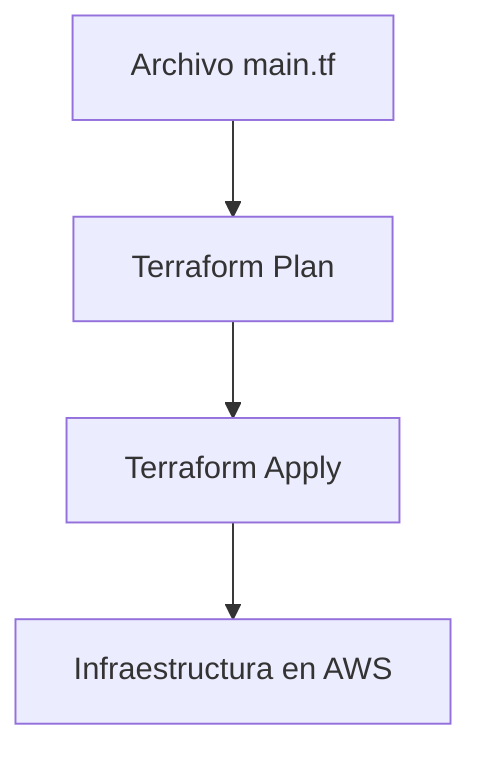
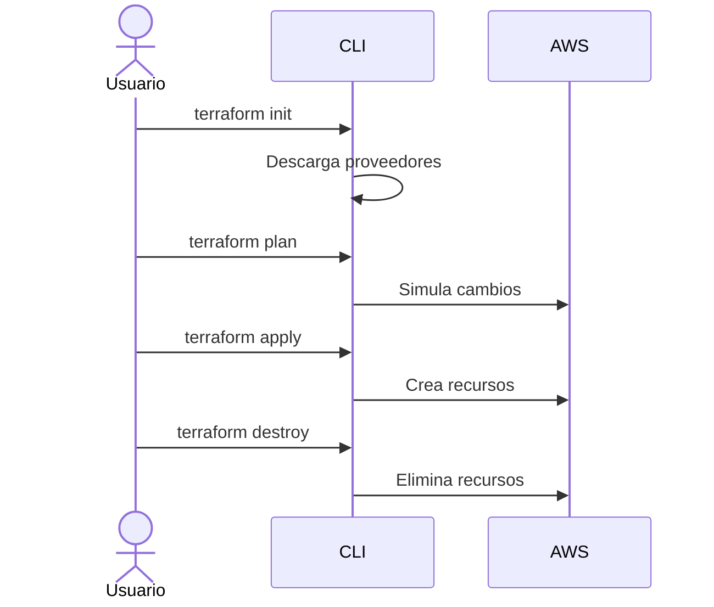
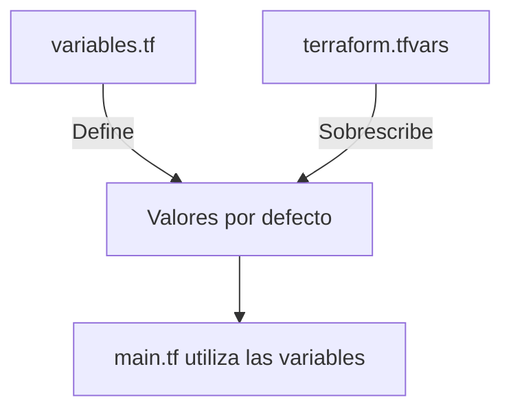

# ☁️ Curso Terraform Bootcamp TalentoTech 2025

> **Aprende a automatizar tu infraestructura con Terraform, paso a paso, desde cero.**

---

## 🚀 Módulo 1: Introducción a Terraform

### 🎯 Objetivos de aprendizaje
- Comprender qué es Terraform y para qué sirve.
- Entender el concepto de *Infraestructura como Código (IaC)*.
- Conocer los principales comandos de Terraform.

### 📘 ¿Qué es Terraform?
Terraform es una herramienta de **Infraestructura como Código (IaC)** que permite **automatizar la creación, gestión y configuración** de recursos en la nube mediante archivos declarativos.

> ⚙️ Terraform convierte tus configuraciones en código versionable. Esto significa que tu infraestructura puede almacenarse y versionarse igual que el código de tu aplicación.

### 🌍 Infraestructura como Código (IaC)

Infraestructura como Código significa **definir servidores, redes, bases de datos y más, usando archivos de texto** que luego Terraform transforma en infraestructura real.

#### 💡 Ejemplo simple:
```hcl
provider "aws" {
  region = "us-east-1"
}

resource "aws_instance" "mi_servidor" {
  ami           = "ami-0c94855ba95c71c99"
  instance_type = "t2.micro"
}
```

### 🧩 Diagrama conceptual (Mermaid)


### 🧠 Mini Quiz
1. ¿Qué significa IaC?
2. ¿Cuál es la diferencia entre `terraform plan` y `terraform apply`?
3. ¿Por qué es importante versionar la infraestructura?

---

## 🧰 Módulo 2: Instalación y Configuración

### 🪟 En Windows
```bash
winget install terraform
terraform -v
```

### 🐧 En Linux
```bash
sudo apt-get update
sudo apt-get install -y unzip
wget https://releases.hashicorp.com/terraform/1.7.0/terraform_1.7.0_linux_amd64.zip
unzip terraform_1.7.0_linux_amd64.zip
sudo mv terraform /usr/local/bin/
terraform -v
```

### 🔑 Configuración AWS CLI
```bash
aws configure
```

**Campos requeridos:**
- Access Key ID
- Secret Access Key
- Región (por ejemplo: `us-east-1`)
- Formato de salida (por ejemplo: `json`)

### 🧠 Mini Quiz
1. ¿Qué comando instala Terraform en Windows?
2. ¿Qué datos se configuran con `aws configure`?

---

## 🏗️ Módulo 3: Tu primer proyecto Terraform

### 🗂️ Estructura inicial
```
📁 terraform-proyecto
 ┣ 📄 main.tf
 ┣ 📄 variables.tf
 ┗ 📄 outputs.tf
```

### ✍️ Código base
```hcl
provider "aws" {
  region = "us-east-1"
}

resource "aws_instance" "nginx_server" {
  ami           = "ami-0c94855ba95c71c99"
  instance_type = "t3.micro"
  user_data     = <<-EOF
                #!/bin/bash
                sudo yum update -y
                sudo amazon-linux-extras install nginx1 -y
                sudo systemctl start nginx
                sudo systemctl enable nginx
                EOF
  tags = {
    Name = "Servidor Nginx"
  }
}
```

### 🧩 Diagrama Terraform Workflow


### ⚙️ Comandos principales
```bash
terraform init     # Inicializa el entorno
terraform plan     # Previsualiza los cambios
terraform apply    # Aplica los cambios
terraform destroy  # Destruye la infraestructura
```

### 🧠 Mini Quiz
1. ¿Qué hace `terraform init`?
2. ¿Qué comando destruye los recursos creados?
3. ¿Qué servicio instala Nginx en la instancia?

---

## ⚙️ Módulo 4: Variables y Archivos .tfvars

### 🎯 Objetivo
Aprender a parametrizar configuraciones y evitar valores fijos en el código.

### 📄 variables.tf
```hcl
variable "instance_type" {
  description = "Tipo de instancia EC2"
  default     = "t3.micro"
}

variable "environment" {
  description = "Ambiente de despliegue"
  default     = "dev"
}
```

### 📄 terraform.tfvars
```hcl
instance_type = "t3.medium"
environment   = "qa"
```

### 🧩 Diagrama Variables


### 🧠 Mini Quiz
1. ¿Qué diferencia hay entre `variables.tf` y `terraform.tfvars`?
2. ¿Qué comando aplica las variables personalizadas?

---

## 📤 Módulo 5: Outputs y Conexión SSH

### 🎯 Objetivo
Aprender a mostrar resultados útiles al finalizar la ejecución.

### 📄 outputs.tf
```hcl
output "instance_ip" {
  description = "Dirección IP pública de la instancia EC2"
  value       = aws_instance.nginx_server.public_ip
}
```

### 📦 Conexión SSH
```bash
ssh -i nginx_server_key.pem ec2-user@<IP_PUBLICA>
```

💡 *Sugerencia visual:* inserta un GIF mostrando la conexión SSH exitosa.

### 🧠 Mini Quiz
1. ¿Para qué sirven los outputs?
2. ¿Qué dato devuelve el output del ejemplo?

---

## 🧱 Módulo 6: Modularización

### 🎯 Objetivo
Organizar el código Terraform en módulos reutilizables.

### 📁 Estructura modular
```
📁 terraform-proyecto
 ┣ 📁 modules
 ┃ ┗ 📁 ec2
 ┃    ┣ 📄 main.tf
 ┃    ┣ 📄 variables.tf
 ┃    ┗ 📄 outputs.tf
 ┣ 📄 main.tf
 ┣ 📄 variables.tf
 ┗ 📄 terraform.tfvars
```

### 📄 main.tf
```hcl
module "ec2_instance" {
  source        = "./modules/ec2"
  instance_type = var.instance_type
  environment   = var.environment
}
```

### 🧠 Mini Quiz
1. ¿Qué ventajas tiene usar módulos?
2. ¿Cómo se define un módulo local?

---

## 🧩 Módulo 7: Ejercicio Práctico Final

🎯 **Objetivo:** desplegar una instancia EC2 con Nginx en AWS usando Terraform.

### 🪜 Pasos
1. Crea una carpeta `terraform-ec2`.
2. Añade los archivos `main.tf`, `variables.tf`, `outputs.tf`.
3. Copia el código del módulo 3.
4. Ejecuta los comandos:
```bash
terraform init
terraform plan
terraform apply
```
5. Copia la IP pública y verifica Nginx:
```bash
curl http://<IP_PUBLICA>
```

✅ **Resultado esperado:** mensaje `Welcome to Nginx!` desde AWS EC2.

🎉 ¡Felicidades! Has completado tu primer despliegue con Terraform.

### 🧠 Evaluación Final
1. ¿Cuál es el ciclo básico de Terraform?
2. ¿Qué ventaja tiene definir variables y outputs?
3. ¿Qué buenas prácticas de seguridad aplicarías?

---

## 🏁 Cierre y próximos pasos

- Implementar módulos avanzados.
- Integrar Terraform con GitHub Actions.
- Desplegar infraestructura multiambiente.
- Aplicar políticas con Terraform Cloud.

💬 *Recuerda:* Terraform no solo crea infraestructura, sino que **la convierte en código controlado, seguro y replicable.**

