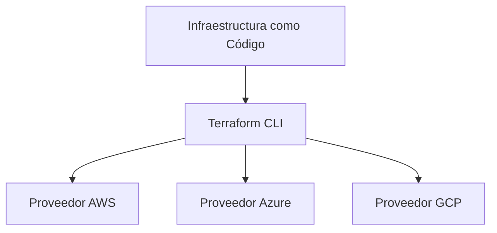
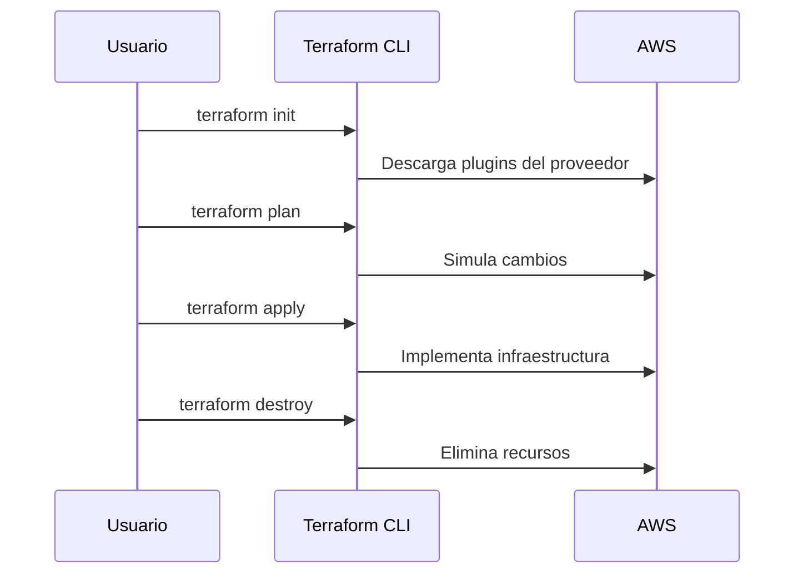

# 📘 Curso Terraform Profesional DevOps

## 1. Introducción
Terraform es una herramienta de *Infrastructure as Code (IaC)* desarrollada por **HashiCorp**, diseñada para automatizar la creación, modificación y eliminación de recursos de infraestructura en múltiples proveedores de nube, como AWS, Azure y Google Cloud.

### 1.1. Principios fundamentales
- **Declaratividad**: el usuario define *qué* desea implementar, no *cómo* hacerlo.
- **Reproducibilidad**: los archivos `.tf` permiten replicar configuraciones de forma precisa.
- **Versionamiento**: la infraestructura se gestiona como código fuente.



### 1.2. Ciclo de vida de Terraform
Terraform sigue un flujo de comandos estándar:
```bash
terraform init     # Inicializa el entorno
terraform plan     # Planifica los cambios
terraform apply    # Aplica la configuración
terraform destroy  # Elimina los recursos
```

Cada etapa puede ejecutarse de manera independiente y controlada, lo que garantiza entornos reproducibles y auditables.

---

## 2. Instalación y configuración

### 2.1. Requisitos
- Cuenta activa en **AWS**.
- **AWS CLI** configurada.
- **Terraform CLI** versión 1.5 o superior.

### 2.2. Instalación
**Windows (PowerShell)**
```bash
winget install terraform
terraform -version
```

**Linux (Ubuntu/Debian)**
```bash
sudo apt update
sudo apt install -y unzip
wget https://releases.hashicorp.com/terraform/1.7.0/terraform_1.7.0_linux_amd64.zip
unzip terraform_1.7.0_linux_amd64.zip
sudo mv terraform /usr/local/bin/
terraform -v
```

### 2.3. Configuración de AWS CLI
```bash
aws configure
```
Proporcionar:
- `AWS Access Key ID`
- `AWS Secret Access Key`
- `Region` (ejemplo: `us-east-1`)
- `Output format` (ejemplo: `json`)

---

## 3. Estructura básica de un proyecto

### 3.1. Estructura de carpetas
```
📁 terraform-ec2
 ┣ 📄 main.tf
 ┣ 📄 variables.tf
 ┗ 📄 outputs.tf
```

### 3.2. main.tf
```hcl
provider "aws" {
  region = var.region
}

resource "aws_instance" "nginx_server" {
  ami           = var.ami
  instance_type = var.instance_type

  user_data = <<-EOF
                #!/bin/bash
                sudo yum update -y
                sudo amazon-linux-extras install nginx1 -y
                sudo systemctl enable nginx
                sudo systemctl start nginx
                EOF

  tags = {
    Name        = "NginxServer-${var.environment}"
    Environment = var.environment
  }
}
```

### 3.3. variables.tf
```hcl
variable "region" {
  description = "Región de despliegue AWS"
  default     = "us-east-1"
}

variable "ami" {
  description = "AMI base Amazon Linux 2"
  default     = "ami-0c94855ba95c71c99"
}

variable "instance_type" {
  description = "Tipo de instancia EC2"
  default     = "t3.micro"
}

variable "environment" {
  description = "Nombre del ambiente"
  default     = "dev"
}
```

### 3.4. outputs.tf
```hcl
output "instance_ip" {
  description = "IP pública de la instancia EC2"
  value       = aws_instance.nginx_server.public_ip
}

output "instance_dns" {
  description = "DNS público de la instancia EC2"
  value       = aws_instance.nginx_server.public_dns
}
```

### 3.5. Diagrama de flujo de comandos


---

## 4. Seguridad y control de acceso

### 4.1. Manejo de credenciales
- **Nunca almacenar claves en texto plano**.
- Usar variables de entorno o servicios como AWS Vault.
- Evitar subir archivos `.tfstate` o `.terraform` a repositorios públicos.

### 4.2. Ejemplo de uso de variables de entorno
```bash
export AWS_ACCESS_KEY_ID=xxxxx
export AWS_SECRET_ACCESS_KEY=yyyyy
```

### 4.3. Políticas IAM mínimas recomendadas
```json
{
  "Version": "2012-10-17",
  "Statement": [
    {
      "Effect": "Allow",
      "Action": [
        "ec2:*",
        "iam:PassRole"
      ],
      "Resource": "*"
    }
  ]
}
```

---

## 5. Modularización avanzada

### 5.1. Estructura modular
```
📁 terraform-ec2
 ┣ 📁 modules
 ┃ ┗ 📁 ec2
 ┃    ┣ 📄 main.tf
 ┃    ┣ 📄 variables.tf
 ┃    ┗ 📄 outputs.tf
 ┣ 📄 main.tf
 ┣ 📄 variables.tf
 ┗ 📄 terraform.tfvars
```

### 5.2. Definición de módulo
```hcl
module "ec2_instance" {
  source        = "./modules/ec2"
  instance_type = var.instance_type
  environment   = var.environment
  ami           = var.ami
}
```

### 5.3. Beneficios de la modularización
- Reutilización del código.
- Escalabilidad en múltiples entornos.
- Mantenibilidad a largo plazo.

---

## 6. Ejercicio práctico final

### Objetivo
Implementar un servidor web Nginx en AWS EC2 utilizando Terraform.

### Pasos
1. Crear la estructura de proyecto descrita en la sección 3.1.
2. Ejecutar los comandos:
```bash
terraform init
terraform plan
terraform apply
```
3. Verificar la instancia en la consola de AWS o mediante:
```bash
curl http://<IP_PUBLICA>
```

**Resultado esperado:**
Salida `Welcome to Nginx!` en la terminal.

---

## 7. Buenas prácticas

| Categoría | Recomendación |
|------------|----------------|
| Versionamiento | Utilizar Git para controlar cambios en los archivos `.tf` |
| Estados | Usar `remote backend` (S3 + DynamoDB) para equipos colaborativos |
| Naming | Adoptar convenciones de nombres coherentes (ej. `project-env-resource`) |
| Destrucción controlada | Evitar `terraform destroy` en entornos productivos |
| Validación | Ejecutar `terraform validate` antes de aplicar cambios |

---

## 8. Evaluación técnica

**Preguntas de repaso:**
1. ¿Cuál es la diferencia entre `terraform plan` y `terraform apply`?
2. ¿Por qué es recomendable usar módulos en proyectos complejos?
3. ¿Qué mecanismo utiliza Terraform para almacenar el estado de la infraestructura?
4. ¿Cómo se garantiza la seguridad de las credenciales en Terraform?
5. ¿Qué ventajas tiene IaC frente a la administración manual de infraestructura?

---

**Fin del Curso – Versión Profesional DevOps**

